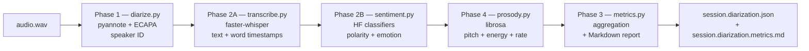

# Target VAD

**Local-first audio analysis pipeline for facilitated classroom discussions.** Takes a recorded session, produces a multi-pass enriched JSON with per-speaker diarization, transcription, sentiment, prosody, and a facilitator-readable AAR Markdown report. All five passes run on CPU, fully air-gapped after model download, no LLM dependency.

Target hardware: AMD Strix Halo (CPU-first for compatibility; iGPU and NPU available for future acceleration work). Currently developed on Windows 11 + Python 3.14.

The project also ships **S2 kiosk talkback** — a real-time wake-word + same-speaker session mode that is structurally separate from the offline analysis pipeline. See its section below.

---

## The 5-pass offline pipeline



Each pass reads the diarization JSON, enriches it (adds fields to segments, adds top-level config blocks), and writes back atomically. The JSON is the single accumulating artifact; the final Markdown report is rendered by Phase 3 from the fully-enriched JSON.

Passes are designed to be **composable and idempotent** — re-running a pass on already-enriched output is a no-op (with a `--rerun` / `--retranscribe` flag for forcing re-analysis). This makes the pipeline robust to partial failures and easy to extend.

The exact pass order in the diagram above is the recommended chain. Phase 4 (prosody) and Phase 3 (metrics) can technically run in either order — both consume the same prior outputs and neither depends on the other.

---

## Hardware & dependencies

| Requirement | Version / Notes |
|---|---|
| **Python** | **3.14 mandatory.** A `python` on PATH that resolves to 3.12 will fail — Python 3.12 doesn't have the dep stack installed. Always invoke `py -3.14`. |
| **OS** | Windows 11 (developed + validated). Linux/macOS should work in principle; not tested. |
| **CPU** | Any modern x86-64. All passes are CPU-only by design. |
| **RAM** | 8 GB minimum; 16 GB recommended (faster-whisper + transformer classifiers + librosa peak ~6 GB combined when chained). |
| **Storage** | ~2 GB for cached models (pyannote, faster-whisper, HF sentiment models). |
| **Network** | First-run only — for HuggingFace model downloads. Fully offline after warm cache. |

### Key Python libraries

| Library | Used by | Purpose |
|---|---|---|
| `pyannote.audio>=3.1.0` | Phase 1 | Speaker diarization (clustering). Validated on 4.0.4. Gated model — requires HF token. |
| `speechbrain>=1.0.0` | Phase 1, enrollment | ECAPA-TDNN speaker embeddings for matching clusters to enrolled voiceprints. |
| `faster-whisper>=1.0.0` | Phase 2A | Transcription with int8 quantization. |
| `transformers>=4.40.0` | Phase 2B | HuggingFace text-classification pipelines for polarity + emotion. |
| `librosa>=0.10.0` | Phase 4 | Pure-DSP prosody features (pitch via pyin, RMS energy). |
| `openwakeword>=0.6.0` | S2 | Wake-word detection for the kiosk mode. |
| `sounddevice>=0.4.6` | S2, enrollment | Microphone I/O (PyAudio replacement — PyAudio won't build on this machine). |
| `torch>=2.1.0`, `torchaudio>=2.1.0` | Phase 1, all model-using passes | Tensor backend. Resolved at 2.9.1 on this machine. |
| `soundfile`, `scipy`, `numpy`, `pyyaml`, `rich`, `onnxruntime` | various | Audio I/O, signal processing, config, CLI output. |

### Gotchas worth knowing up front

1. **HuggingFace token + gated-model setup** — Phase 1 (`diarize.py`) needs `HF_TOKEN` in the environment and three gated pyannote repos accepted on huggingface.co. See [docs/superpowers/specs/2026-05-14-classroom-diarization-design.md](docs/superpowers/specs/2026-05-14-classroom-diarization-design.md) for the full setup. Symptom of a missing piece: 403 on download.

2. **Windows cp1252 console encoding** — the default Windows console can't render Unicode arrows (`→`). The CLI tools use ASCII (`->`) for stdout. Markdown reports are written as UTF-8 files and render correctly in any viewer.

3. **C10 microphone DSP** — the Nuroum C10 (a development reference mic for S2) applies always-on echo cancellation, AGC, noise suppression, and beamforming with no bypass. Same-speaker cosine similarity lands at 0.4–0.7 instead of the canonical 0.7–0.9 because of this distortion. The 0.50 decision-smoother threshold is tuned for these conditions — raise once a quieter mic is benchmarked.

4. **torchaudio 2.9 vs speechbrain 1.0.3** — `torchaudio.list_audio_backends()` was removed in 2.9 but speechbrain 1.0.3 still calls it. A monkey-patch in `target-vad/core/compat.py` provides a stub. All CLI entry points import `core.compat` first to apply the patch before any speechbrain import.

5. **C10 / Windows symlink privilege** — SpeechBrain's model cache uses symlinks by default which fail on Windows without admin. The `EmbeddingExtractor` passes `local_strategy=LocalStrategy.COPY` to work around this.

---

## Quick start — end-to-end on one recording

From `target-vad/`, run the five passes in order on `recording.wav`:

```bash
# Phase 1: diarize (requires HF_TOKEN)
py -3.14 diarize.py recording.wav

# Phase 2A: transcribe (reads the diarization JSON written above)
py -3.14 transcribe.py recording.wav.diarization.json

# Phase 2B: sentiment (text-only; no audio re-read)
py -3.14 sentiment.py recording.wav.diarization.json

# Phase 4: prosody (re-reads the audio for librosa)
py -3.14 prosody.py recording.wav.diarization.json

# Phase 3: metrics + Markdown AAR report (no audio)
py -3.14 metrics.py recording.wav.diarization.json
```

Outputs:
- `recording.wav.diarization.json` — single fully-enriched JSON
- `recording.wav.diarization.metrics.md` — facilitator-readable AAR report
- `recording.wav.diarization.rttm` — only if Phase 1 was run with `--rttm`

### Optional flags worth knowing

```bash
# Session-scoped enrollment via an intros manifest (Phase 1)
py -3.14 diarize.py recording.wav --introductions intros.json

# RTTM sidecar (Phase 1)
py -3.14 diarize.py recording.wav --rttm

# Force re-transcription of all segments (Phase 2A)
py -3.14 transcribe.py recording.wav.diarization.json --retranscribe

# Force re-classification (Phase 2B / 4)
py -3.14 sentiment.py recording.wav.diarization.json --rerun
py -3.14 prosody.py recording.wav.diarization.json --rerun

# Custom output path (any pass)
py -3.14 sentiment.py input.json --out enriched.json

# Override the audio path embedded in the JSON (Phase 2A / 4)
py -3.14 prosody.py session.json --audio /path/to/audio.wav
```

A live S1 + 2A + 2B + 4 + 3 chain on a ~90s recording takes 2–5 minutes cold (first run downloads models) and 30–60 seconds warm. Phase 2A is the dominant cost; the others are sub-10s each.

---

## Per-pass deep dives

### Phase 1 — Diarization & speaker ID (`diarize.py`)

**What it does.** Loads the WAV, runs pyannote.audio's `speaker-diarization-3.1` pipeline to produce time-tagged speaker clusters, then ECAPA-embeds each cluster and cosine-matches against enrolled voiceprints to assign stable speaker IDs.

**Inputs.** A WAV file (any sample rate, mono or stereo — internally resampled to 16 kHz mono). Optional `--introductions` JSON manifest for session-scoped enrollment. Persistent voiceprints in `./voiceprints/` (one `.npy` per enrolled speaker, plus a `users.json` mapping storage id → display name).

**Outputs.** `<input>.diarization.json` with `segments` array (start, end, speaker_id, speaker), top-level `enrolled_users_matched`, `unknown_speakers_observed`, `config`, `passes_run: ["diarization"]`. Optional `--rttm` writes a sidecar RTTM.

**Speaker resolution.** Each pyannote cluster gets one of three labels:
- **Enrolled match** (`speaker_id: "siddharth"`) — cluster embedding cosine ≥ `identification_threshold` (default 0.55) against a voiceprint.
- **Recurring unknown** (`speaker_id: "SPEAKER_00"` — literal pyannote cluster id preserved) — no enrollment match, but the cluster passes a recurrence+substance threshold (default ≥2 segments AND ≥10 s total talk). These appear in `unknown_speakers_observed` with `{id, segment_count, talk_seconds}`.
- **Catchall unknown** (`speaker_id: "unknown"`) — sub-threshold unmatched cluster, lumped into a single anonymous bucket.

The threshold gate prevents one-off / brief unmatched segments from cluttering the per-speaker output while preserving pyannote's identity work for substantive recurring voices.

**Key config knobs** (under `diarization:` in `config.yaml`):
- `identification_threshold: 0.55` — cosine bar for enrollment match
- `unknown_min_segments: 2`, `unknown_min_seconds: 10.0` — recurring-unknown gate
- `intro_override_warn_threshold: 0.30` — flags when an `--introductions` voiceprint disagrees with the same persistent id
- `pyannote_pipeline`, `centroid_max_sample_seconds`, `hf_token_env_var`

**Cost.** First run downloads ~500 MB of pyannote models. Then ~30 s for a 5-minute recording on CPU.

**Specs.** [Classroom diarization design](docs/superpowers/specs/2026-05-14-classroom-diarization-design.md), [in-session enrollment](docs/superpowers/specs/2026-05-15-in-session-enrollment-design.md), [recurring-unknown clusters](docs/superpowers/specs/2026-05-16-recurring-unknown-clusters-design.md), [pyannote HF setup](docs/superpowers/specs/2026-05-14-classroom-diarization-design.md).

### Phase 2A — Transcription (`transcribe.py`)

**What it does.** For each segment in the diarization JSON, slices the audio chunk and runs faster-whisper to produce `text` and `words` (per-word `{start, end, word, probability}`). Word timestamps are converted from segment-relative to WAV-absolute so downstream consumers can seek into the original audio directly.

**Rolling context.** Each segment's transcription receives a rolling `initial_prompt` built from the previous N characters of transcript (default 200), improving cross-segment coherence on technical vocabulary.

**Hard-required prior pass.** `passes_run` must include `"diarization"`. Otherwise exit 2 with a pointer to `diarize.py`.

**Idempotence.** Segments with non-empty `text` are skipped by default. `--retranscribe` forces full re-run.

**Model selection** (`transcription.model` in config or `--model` flag):
- `small` — faster-whisper's `small` (~244 MB, ~3× realtime on CPU). Default.
- `large` — faster-whisper's `large-v3` (~3 GB, ~0.5× realtime on CPU).
- Any other string is passed through to faster-whisper as-is (forward-compat for future models).

**Key config knobs** (under `transcription:`):
- `model: "small"`, `language: "en"`, `compute_type: "int8"` (CPU-optimal)
- `initial_prompt_chars: 200`

**Cost.** First run downloads the model. Then ~30–120 s for a 90-s recording with `small`; ~3–5× longer with `large`.

**Spec.** [Transcription pass design](docs/superpowers/specs/2026-05-15-transcription-pass-design.md).

### Phase 2B — Sentiment (`sentiment.py`)

**What it does.** Reads each segment's `text` and classifies it with two HuggingFace text-classification pipelines: 3-class polarity (positive/neutral/negative, default `cardiffnlp/twitter-roberta-base-sentiment-latest`) and 7-class Ekman+neutral emotion (joy/sadness/anger/fear/surprise/disgust/neutral, default `j-hartmann/emotion-english-distilroberta-base`). Attaches a nested `sentiment.{polarity, emotion}` block per segment with full probability distributions.

**Text-only.** No audio re-read. Pure transformer inference on CPU.

**Hard-required prior pass.** `passes_run` must include `"transcription"`. Exit 2 with a pointer otherwise.

**Idempotence.** Segments with existing `sentiment` skipped by default. `--rerun` forces full re-classification.

**Known calibration note (disgust).** The `j-hartmann/emotion-english-distilroberta-base` model fires the `disgust` class on polite-disagreement phrasing ("Sorry, I understand but...") far more often than it does on actual revulsion. Phase 3's Markdown report includes a footnote flagging this; downstream consumers should treat `disgust` as "registered disagreement" rather than visceral disgust in classroom contexts.

**Key config knobs** (under `sentiment:`):
- `polarity_model`, `emotion_model` (HF identifiers or local paths)
- `device: "cpu"`, `batch_size: 16`

**Cost.** First run downloads ~830 MB combined. Then ~5–10 s for a 90-s recording.

**Spec.** [Sentiment pass design](docs/superpowers/specs/2026-05-15-sentiment-pass-design.md).

### Phase 4 — Prosody (`prosody.py`)

**What it does.** Reads each segment's audio chunk and word timestamps, computes 7 prosodic features per segment via librosa DSP:

- **Pitch:** `pitch_hz_median`, `pitch_hz_std`, `pitch_range_hz` (5th-95th percentile, robust to octave-error outliers) — computed from `librosa.pyin` on voiced frames.
- **Energy:** `energy_db_mean`, `energy_db_range` — computed from RMS over 25 ms frames with 10 ms hop, converted to absolute dB.
- **Rate:** `speech_rate_wps`, `pause_ratio` — derived from Phase 2A's word timestamps.

Also emits top-level `prosody_baselines` keyed by `speaker_id` with `{pitch_hz_median, pitch_hz_iqr, energy_db_median, energy_db_iqr, segment_count}` — median + IQR robust against outliers like shouts or whispers. Consumers compute "Speaker A's pitch in segment X was N IQRs above their baseline" from raw + baseline data.

**Hard-required prior pass.** `passes_run` must include `"transcription"` (rate features need word timestamps).

**Idempotence.** Segments with non-null `prosody` skipped by default. `--rerun` forces full re-analysis. Baselines always recomputed (cheap pure-Python pass).

**Sentinel.** `prosody: null` when a segment has zero voiced frames AND empty words. Otherwise, individual fields can be null when the corresponding signal is absent (pitch null when all frames unvoiced; rate null when no words).

**Key config knobs** (under `prosody:`):
- `pitch_min_hz: 80`, `pitch_max_hz: 400` (pyin bounds)
- `frame_length_ms: 25`, `hop_length_ms: 10`

**Cost.** No model download (pure DSP). ~10–30 s for a 90-s recording (cold-start dominated by numba JIT for pyin).

**Spec.** [Prosody pass design](docs/superpowers/specs/2026-05-16-prosody-pass-design.md).

### Phase 3 — Contribution metrics (`metrics.py`)

**What it does.** Reads the fully-enriched JSON, computes per-speaker + session-level aggregates, a 5-minute bucketed activity timeline, and up to 5 deterministic narrative highlights. Writes a top-level `contribution_metrics` block back to the JSON AND renders a sibling Markdown AAR report (`<input-stem>.metrics.md`) designed to be read top-to-bottom by a facilitator.

**Six aggregators run in fixed order:**
1. **Participation** — per-speaker talk seconds + percent, segment count, word count, WPM, mean/median/max segment length
2. **Sentiment** — polarity counts/percents/mean-confidence, emotion counts/percents/mean-confidence, per speaker
3. **Turn-taking** — turn count (consecutive same-speaker segments collapse to one turn), mean gap before turn (excluding interruptions), interruption count
4. **Pairwise followers** — full who-follows-whom transition matrix, deterministic ordering
5. **Timeline** — fixed-width 5-min buckets with per-speaker talk seconds (proportionally apportioned across boundaries) + per-speaker polarity/emotion mode credited to the bucket containing the segment's start
6. **Highlights** — up to `top_k_highlights` deterministic callouts, priority order: `longest_segment`, `most_positive`, `most_negative`, `high_disgust_window`, `quietest_window`, `busiest_window`, `solo_dominator`. Ties broken by earliest start, then alphabetical sid.

**3-way speaker breakdown.** The Markdown header reads `**Speakers:** N (E enrolled, R recurring unknown, C catchall)`. `identified_speakers` is computed from the JSON's `enrolled_users_matched` list (authoritative); `recurring_unknown_speakers` from `unknown_speakers_observed`; `catchall` is 1 if any segment has `speaker_id == "unknown"` else 0.

**Hard-required prior passes.** `passes_run` must include both `"transcription"` and `"sentiment"`. Exit 2 otherwise.

**Idempotence.** Pure aggregation — re-running always overwrites the metrics block and Markdown. No `--rerun` flag needed.

**Key config knobs** (under `metrics:`):
- `bucket_seconds: 300` (5-min activity buckets)
- `top_k_highlights: 5`
- `quote_max_chars: 100` (truncation for highlight quotes)

**Cost.** Sub-second on any session length. Pure Python aggregation + string formatting.

**Spec.** [Contribution metrics design](docs/superpowers/specs/2026-05-16-contribution-metrics-design.md).

### S2 — Kiosk talkback (`kiosk.py`)

**Note: structurally separate from the offline pipeline above.** S2 is a real-time, microphone-driven mode that does NOT produce a diarization JSON. It is provided in the same repo because it shares the core speaker stack.

**What it does.** Listens continuously on the mic. On a wake-phrase (`hey_jarvis` by default) it captures the first speech segment as the session's primary-speaker snapshot, then routes subsequent same-speaker segments to a user-supplied callback while ignoring other voices. Designed for hands-free conversational kiosk interactions where the kiosk must know "is this still the same person?" without interrupting them.

**Architecture.** A simple state machine: `IDLE → AWAITING_SPEECH → ACTIVE_SESSION`. The decision smoother (window=3, M-of-N=2, cosine threshold 0.50) decides whether each subsequent segment is still the same speaker.

**Validated empirically on the C10** — wake confidence reliable (0.8–0.99); same-speaker cosines 0.4–0.7; the 0.50 threshold fires correctly. Non-self false-positive measurement is still a gap (no recording of an interloper voice exists in test fixtures).

**Spec.** [Kiosk talkback design](docs/superpowers/specs/2026-05-14-kiosk-talkback-design.md).

### Voiceprint enrollment (`enroll.py`)

**What it does.** A utility CLI for managing persistent voiceprints stored in `./voiceprints/`. Two subcommands:

```bash
py -3.14 enroll.py enroll --user siddharth --name "Siddharth Jain"
py -3.14 enroll.py delete --user siddharth
```

`enroll` prompts the user to record N short utterances (default 5), embeds each via ECAPA, and stores the centroid in `voiceprints/siddharth.npy` plus a `users.json` entry mapping id → display name. A self-similarity gate (default `enrollment_min_self_similarity: 0.6`) rejects captures where the user's own utterances don't pair well — a signal that the mic conditions are bad.

The resulting voiceprints are read by Phase 1 (`diarize.py`) when matching clusters and by S2 (`kiosk.py`) when forming the session snapshot.

**Spec.** [Shared speaker stack](docs/superpowers/specs/2026-05-14-shared-speaker-stack.md).

---

## Project structure

```
TVAD/
├── target-vad/                    # the project root (everything below this is target-vad/)
│   ├── core/                      # shared primitives
│   │   ├── audio/
│   │   │   ├── load.py            # load_audio_as_mono16k — shared by diarize, transcribe, prosody
│   │   │   └── mic_stream.py      # sounddevice-based microphone iterator (S2)
│   │   ├── speaker/
│   │   │   ├── embedder.py        # ECAPA-TDNN embedding extractor
│   │   │   ├── enrollment_store.py
│   │   │   ├── verifier.py        # cosine similarity
│   │   │   └── decision_smoother.py  # M-of-N smoother used by S2
│   │   ├── vad/
│   │   │   └── silero_vad.py      # Silero VAD wrapper for S2
│   │   └── compat.py              # torchaudio 2.9 / speechbrain 1.0.3 monkey-patch
│   ├── modes/                     # per-pass packages
│   │   ├── diarization/           # pyannote wrapper + cluster identification + RTTM
│   │   ├── kiosk/                 # S2 pipeline state machine + wake word
│   │   ├── sentiment/             # HF classifier wrapper
│   │   ├── metrics/               # aggregators + Markdown renderer
│   │   └── prosody/               # librosa analyzer + baselines aggregator
│   ├── tests/                     # 237 tests across 6 test packages, pure-python+mocks where possible
│   ├── diarize.py                 # Phase 1 CLI
│   ├── kiosk.py                   # S2 CLI
│   ├── transcribe.py              # Phase 2A CLI
│   ├── sentiment.py               # Phase 2B CLI
│   ├── prosody.py                 # Phase 4 CLI
│   ├── metrics.py                 # Phase 3 CLI
│   ├── enroll.py                  # voiceprint enrollment utility
│   ├── config.yaml                # all per-pass knobs in one file
│   ├── requirements.txt           # pinned dependencies
│   └── voiceprints/               # persistent voiceprints (gitignored at runtime)
├── docs/
│   ├── superpowers/specs/         # per-feature design specs (read these to understand "why")
│   ├── superpowers/plans/         # per-feature implementation plans (TDD task lists)
│   └── INTEGRATION.md             # JSON schema + CLI reference for consumers (LAILAI, agents, etc.)
├── README.md                      # this file
└── Voice 001 short.wav            # smoke-test fixture audio (~90s)
```

Tests run with `py -3.14 -m pytest tests/ -q` from `target-vad/`. 237 tests passing as of the prosody-pass ship (2026-05-16).

---

## Status & known limitations

### Shipped & validated

- **Phase 1 (S1)** — validated 2026-05-15 on a 90 s real recording. 2 clusters detected, both labeled correctly with session-scoped enrollment ids. RTTM emission verified.
- **S2 kiosk** — validated 2026-05-14 on the C10. Wake fire reliable; smoother fires `[MATCH]` on subsequent same-speaker segments.
- **Phase 2A transcription** — validated 2026-05-15. 90 s recording transcribed in ~2 minutes cold with `small`. Word timestamps WAV-absolute. Coherent multi-segment transcripts (radar / aircraft control discussion).
- **Phase 2B sentiment** — validated 2026-05-15. Both classifier models downloaded + classified the 9-segment fixture in ~6 min cold, ~10 s warm rerun.
- **Phase 3 metrics** — validated 2026-05-16. Coherent JSON block + readable Markdown report. Backward-compatible read path verified.
- **Phase 4 prosody** — validated 2026-05-16. Speaker A median 93.5 Hz (deep voice); Speaker B median 152.8 Hz, IQR 35.4. Partial-null handling works (pitch null + energy/rate populated on short ambiguous segments).
- **Recurring-unknown cluster identity** — validated 2026-05-16 both backward-compat (existing fixture) and forward-compat (synthetic no-intros JSON).

### Validation gaps

- **Non-self false-positive test for S2** — never run. The 0.50 cosine threshold is tuned for "siddharth vs siddharth" but no other voice has been tested. This is the highest-value validation gap in the project.
- **Real classroom conditions** — all testing single-user, mostly-quiet room. Crosstalk / multi-speaker overlap behavior is unmeasured.
- **Multi-bucket activity-chart rendering** — Phase 3's Markdown bar chart is only exercised when a session is ≥ 10 minutes; no unit-test fixture covers that path. Manual smoke is the only verification.
- **Live no-intros S1 run on real audio** — requires `HF_TOKEN` in the shell environment. The synthetic forward-path test in the recurring-unknown work stands in for it but doesn't replace a real-audio E2E.

### Deferred / out of scope (non-LLM)

- **Phase 3 metrics integration of Phase 4 prosody** — the Markdown report doesn't currently surface prosody data, even though it's in the JSON. Renderer-only change, planned next.
- **Topic segmentation** — sentence-BERT clustering for topic-boundary detection. Spec not yet written.
- **Cross-session comparison** — longitudinal aggregation across multiple sessions. Needs a small session-store; defer until multi-session corpus exists.
- **Audio-loader cleanup follow-up** — `_atomic_write_json` is currently copy-pasted across 4 CLI entry points; planned extraction to `core/io/atomic.py`.

### Reserved for LLM-driven future work

- **Phase 2C — Engagement labels.** The sentiment pass schema reserves a `sentiment.engagement` slot for LLM-driven engagement classification (engaged / curious / hesitant / frustrated / dismissive). Backend choice (local llama.cpp vs Anthropic API) is unresolved. When implemented, it will be a separate `engagement.py` pass that reads the JSON, calls an LLM per segment with prompt caching, and adds `sentiment.engagement: {label, score, scores}` per segment plus an `engagement_config` top-level block. See the deferred section of [the sentiment pass spec](docs/superpowers/specs/2026-05-15-sentiment-pass-design.md) for the integration plan.

This is the natural integration point for the LAILAI project, which provides the local-LLM backend. See [docs/INTEGRATION.md](docs/INTEGRATION.md) for the integration recipe.

---

## Specs & further reading

All specs in `docs/superpowers/specs/`, chronologically:

| Spec | Topic |
|---|---|
| [2026-05-14-shared-speaker-stack](docs/superpowers/specs/2026-05-14-shared-speaker-stack.md) | The `core/speaker/` primitives shared across all modes |
| [2026-05-14-classroom-diarization-design](docs/superpowers/specs/2026-05-14-classroom-diarization-design.md) | Phase 1 (S1) design, including pyannote HF token setup |
| [2026-05-14-kiosk-talkback-design](docs/superpowers/specs/2026-05-14-kiosk-talkback-design.md) | S2 design |
| [2026-05-15-in-session-enrollment-design](docs/superpowers/specs/2026-05-15-in-session-enrollment-design.md) | The `--introductions` manifest mode for Phase 1 |
| [2026-05-15-transcription-pass-design](docs/superpowers/specs/2026-05-15-transcription-pass-design.md) | Phase 2A design |
| [2026-05-15-sentiment-pass-design](docs/superpowers/specs/2026-05-15-sentiment-pass-design.md) | Phase 2B design (with Phase 2C reserved slot) |
| [2026-05-16-contribution-metrics-design](docs/superpowers/specs/2026-05-16-contribution-metrics-design.md) | Phase 3 design |
| [2026-05-16-recurring-unknown-clusters-design](docs/superpowers/specs/2026-05-16-recurring-unknown-clusters-design.md) | S1 schema upgrade preserving pyannote cluster ids |
| [2026-05-16-prosody-pass-design](docs/superpowers/specs/2026-05-16-prosody-pass-design.md) | Phase 4 design |

For integrating TVAD into another codebase, see [docs/INTEGRATION.md](docs/INTEGRATION.md).
