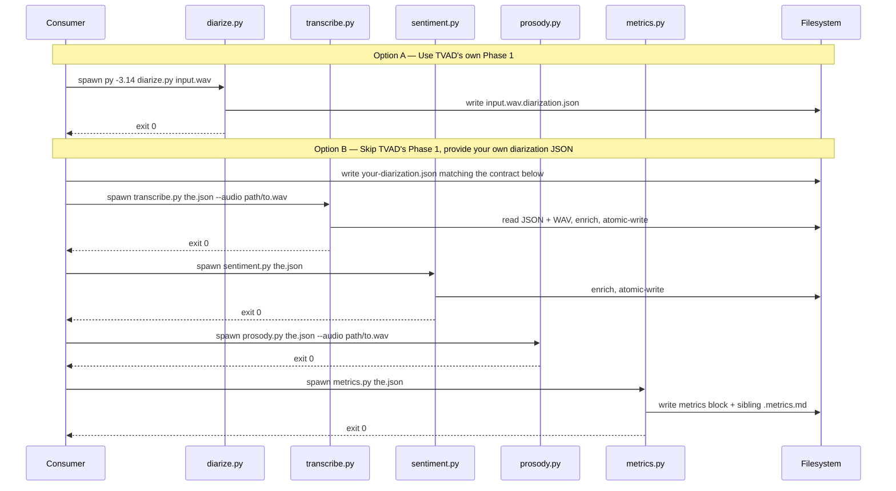

# TVAD Integration Reference

This document is the contract surface for an external consumer that wants to call TVAD from another codebase or agentic workflow. It documents the JSON schema, CLI surfaces, exit codes, error modes, and idempotence semantics of every pass.

If you only want to know **what TVAD does**, read [the README](../README.md) instead. This doc assumes you already know that.

---

## 1. Integration model

**TVAD is a set of standalone Python CLIs that operate on a single accumulating JSON artifact + an audio WAV.** The natural integration mode is **subprocess** — the consumer spawns `py -3.14 <pass>.py …`, waits, and reads the resulting JSON. The JSON is the API.

Why subprocess and not Python import:

- TVAD requires Python 3.14 specifically (deps installed only under 3.14). Most consumers will be on a different Python version or a different language entirely (Node.js, Electron, Go, …).
- Subprocess isolation prevents TVAD's transformer / faster-whisper / torch state from polluting the consumer's process.
- Each pass loads heavy models (pyannote, whisper, sentence transformers) — a long-running consumer doesn't want them resident.
- CLI + JSON is the lowest-common-denominator interface that doesn't change across language ecosystems.

**The integration surface is therefore three things:**

1. **Input JSON contract** — what shape the consumer must produce (or accept from TVAD's Phase 1) before invoking the analysis passes.
2. **Per-pass CLI surface** — args, exit codes, prerequisites.
3. **Output JSON schema** — what each pass adds to the JSON.

All three are documented below.



**LAILAI specifically:** see Appendix A for the field mapping from sherpa-onnx meeting output to TVAD diarization JSON.

---

## 2. Minimal input JSON contract

If you want to skip TVAD's Phase 1 entirely (because your codebase has its own diarization stack — e.g. sherpa-onnx, AWS Transcribe, AssemblyAI), you can produce a JSON that matches this contract and feed it into Phase 2A onward.

### Required top-level fields

```json
{
  "audio_file": "/absolute/path/to/audio.wav",
  "duration_s": 90.0,
  "diarized_at": "2026-05-16T10:00:00Z",
  "config": { ... },
  "enrolled_users_matched": [{"id": "...", "name": "..."}, ...],
  "segments": [ ... ],
  "passes_run": ["diarization"]
}
```

| Field | Type | Required | Notes |
|---|---|---|---|
| `audio_file` | string | yes | Absolute path. `prosody.py` and `transcribe.py` will resolve this unless overridden with `--audio`. |
| `duration_s` | float | yes | Total audio duration in seconds. Used by `metrics.py` for silence calculation and by `prosody.py`/`metrics.py` for bucket bounds. |
| `diarized_at` | string | yes | ISO-8601 timestamp. Informational. |
| `config` | object | yes | The diarization run's config — can be `{}` if you didn't use TVAD's `diarize.py`. Carried through unchanged by subsequent passes. |
| `enrolled_users_matched` | array | yes | Per-speaker `{id, name}` for speakers that were matched against an enrolled voiceprint. Empty list if no enrollment was used. |
| `unknown_speakers_observed` | array | recommended | Per-speaker `{id, segment_count, talk_seconds}` for speakers preserved by the recurring-unknown threshold (substantive unmatched clusters). Empty list when none. If omitted, `metrics.py` reads it as `[]` (backward-compatible). |
| `segments` | array | yes | See below. |
| `passes_run` | array of string | yes | Must include `"diarization"`. Subsequent passes append their names. |

### Required per-segment fields

```json
{
  "start": 0.42,
  "end": 3.81,
  "speaker_id": "siddharth",
  "speaker": "Siddharth Jain"
}
```

| Field | Type | Required | Notes |
|---|---|---|---|
| `start` | float | yes | Segment start in seconds (WAV-absolute). |
| `end` | float | yes | Segment end in seconds (WAV-absolute). Must satisfy `end > start`. |
| `speaker_id` | string | yes | Stable storage identifier. Either an enrolled-user id (e.g. `"siddharth"`), the literal `"unknown"` catchall, or any other token (e.g. `"SPEAKER_00"`) for substantive unmatched clusters. **Convention:** ids matching `^SPEAKER_\d+$` are treated as "preserved pyannote cluster ids" by the metrics 3-way breakdown — don't enroll a user with such an id. |
| `speaker` | string | yes | Display name. Free-form. For the catchall, set to `"unknown"`. For pyannote-id segments, the recommended default is to mirror `speaker_id` (e.g. `"SPEAKER_00"`). |

Segments are expected to be ordered by `start` ascending. The downstream passes don't re-sort but most aggregations assume chronological order. If your upstream produces unordered segments, sort before writing.

### Audio file contract

- Any sample rate, any channel count — TVAD resamples to **16 kHz mono float32** internally via `core/audio/load.py`.
- Tested formats: PCM WAV. Other `soundfile`-readable formats should work; not tested.
- For best results pass uncompressed WAV. Compressed inputs (MP3, M4A) trigger format conversion before TVAD touches them.

---

## 3. Per-pass CLI reference

All five passes share these conventions:

- Invoked as `py -3.14 <pass>.py <input> [flags]`. The positional argument is either a WAV (Phase 1) or a JSON (everything else).
- Exit code `0` on success, `2` on user-supplied bad input, `3` on environment/IO/model failure. No other codes.
- The atomic-write pattern (temp file in same directory + `os.replace`) means a crashed pass leaves the input JSON unmodified. Safe to retry.
- `rich`-formatted stdout. No structured logging in v1. Stderr is empty unless Python itself crashes.
- All passes read `./config.yaml` by default; override with `--config /path/to/config.yaml`.

### 3.1 Phase 1 — `diarize.py`

```
py -3.14 diarize.py <input.wav> [--out <path>] [--rttm] [--introductions <manifest.json>] [--config <path>]
```

| Argument | Required | Notes |
|---|---|---|
| `input.wav` | yes | Path to a WAV file. |
| `--out` | no | Output JSON path. Default: `<input>.diarization.json`. |
| `--rttm` | no | Also write `<input>.diarization.rttm` (NIST RTTM format, useful for diarization eval tooling). |
| `--introductions` | no | Path to a JSON manifest of intro time-ranges + ids + names for session-scoped enrollment. See [in-session enrollment spec](superpowers/specs/2026-05-15-in-session-enrollment-design.md). |
| `--config` | no | Path to `config.yaml`. Default: `./config.yaml`. |

**Environment:** requires `HF_TOKEN` env var. The token must have read access to gated repos AND the three pyannote repos (`speaker-diarization-3.1`, `segmentation-3.0`, `speaker-diarization-community-1`) must be license-accepted on huggingface.co under the same account. See the spec for details.

**Exit codes:** 0 success, 2 missing/unreadable WAV, 3 missing HF_TOKEN / missing config / pyannote pipeline failure.

**Side effects:** writes the JSON (and optional RTTM) using atomic temp+rename. Reads (and downloads to cache on first run) the pyannote models from `~/.cache/huggingface/`.

### 3.2 Phase 2A — `transcribe.py`

```
py -3.14 transcribe.py <diarization.json> [--out <path>] [--audio <wav>] [--model <id>] [--retranscribe] [--config <path>]
```

| Argument | Required | Notes |
|---|---|---|
| `diarization.json` | yes | Output of Phase 1 (or a compatible JSON per the contract above). |
| `--out` | no | Output JSON path. Default: in-place atomic write. |
| `--audio` | no | Override the WAV path embedded in the JSON's `audio_file` field. Useful when the JSON has a stale absolute path. |
| `--model` | no | Override config's `transcription.model`. `small` → faster-whisper `small`; `large` → `large-v3`; any other string passed through. |
| `--retranscribe` | no | Re-transcribe segments that already have `text`. Default: skip them (incremental processing). |
| `--config` | no | Path to `config.yaml`. |

**Prerequisites:** JSON must have `passes_run` ⊇ `{"diarization"}`. Otherwise exit 2.

**Exit codes:** 0 success, 2 missing JSON/WAV/segment field/prerequisite pass, 3 model load failure or atomic-write failure.

### 3.3 Phase 2B — `sentiment.py`

```
py -3.14 sentiment.py <diarization.json> [--out <path>] [--rerun] [--config <path>]
```

| Argument | Required | Notes |
|---|---|---|
| `diarization.json` | yes | Output of Phase 2A (must have `text` per segment). |
| `--out` | no | Output JSON path. Default: in-place atomic write. |
| `--rerun` | no | Re-classify segments that already have a `sentiment` field. Default: skip them. |
| `--config` | no | Path to `config.yaml`. |

**Prerequisites:** every segment must have a `text` field (string, or `null`/empty for silent segments — both treated as "nothing to classify" and result in `sentiment: null`). Mixed states (some segments have `text`, others don't) → exit 2 with the offending segment index.

**Exit codes:** 0 success, 2 missing JSON / missing `text` on any segment, 3 model load failure / atomic-write failure / model emits non-canonical label.

### 3.4 Phase 4 — `prosody.py`

```
py -3.14 prosody.py <diarization.json> [--audio <wav>] [--out <path>] [--rerun] [--config <path>]
```

| Argument | Required | Notes |
|---|---|---|
| `diarization.json` | yes | Output of Phase 2A (must have `words` per segment for rate computation). |
| `--audio` | no | Override the WAV path. |
| `--out` | no | Output JSON path. Default: in-place atomic write. |
| `--rerun` | no | Re-analyze segments that already have `prosody`. |
| `--config` | no | Path to `config.yaml`. |

**Prerequisites:** `passes_run` ⊇ `{"transcription"}` AND every segment must have `text` and `words` fields. The WAV file at `audio_file` (or `--audio`) must exist and be readable.

**Exit codes:** 0 success, 2 missing JSON / missing prerequisite pass / missing segment field / missing audio, 3 missing `prosody:` config block.

### 3.5 Phase 3 — `metrics.py`

```
py -3.14 metrics.py <diarization.json> [--out <path>] [--report <md-path>] [--config <path>]
```

| Argument | Required | Notes |
|---|---|---|
| `diarization.json` | yes | Output of Phase 2A + 2B. |
| `--out` | no | Output JSON path. Default: in-place atomic write. |
| `--report` | no | Markdown report path. Default: `<input-stem>.metrics.md` next to the JSON. |
| `--config` | no | Path to `config.yaml`. |

**Prerequisites:** `passes_run` ⊇ `{"transcription", "sentiment"}` AND every segment must have `text`, `words`, and `sentiment` fields. The `sentiment` field can be the explicit-null sentinel.

**Exit codes:** 0 success, 2 missing JSON / missing prerequisite passes / missing segment fields, 3 missing `metrics:` config block / atomic write failure / Markdown write failure.

**No `--rerun` flag** — `metrics.py` is pure aggregation and always overwrites the metrics block + Markdown.

---

## 4. Cumulative output JSON schema

The diarization JSON is the single accumulating artifact. Each pass adds fields to segments and adds a top-level config block. Schema documented below in the order they appear after a full chain.

### 4.1 Top-level fields

After all 5 passes:

```json
{
  "audio_file": "/absolute/path/to/audio.wav",
  "duration_s": 90.0,
  "diarized_at": "2026-05-15T10:00:00Z",
  "config": { ... },                          // Phase 1's config snapshot
  "enrolled_users_matched": [{"id", "name"}],
  "unknown_speakers_observed": [{"id", "segment_count", "talk_seconds"}],
  "segments": [ ... ],                        // see 4.2

  "transcription_config": {                   // added by Phase 2A
    "model": "small",
    "language": "en",
    "initial_prompt_chars": 200,
    "compute_type": "int8",
    "transcribed_at": "ISO-8601"
  },

  "sentiment_config": {                       // added by Phase 2B
    "polarity_model": "cardiffnlp/...",
    "emotion_model": "j-hartmann/...",
    "device": "cpu",
    "batch_size": 16,
    "analyzed_at": "ISO-8601"
  },

  "prosody_config": {                         // added by Phase 4
    "pitch_min_hz": 80,
    "pitch_max_hz": 400,
    "frame_length_ms": 25,
    "hop_length_ms": 10,
    "analyzed_at": "ISO-8601"
  },

  "prosody_baselines": {                      // added by Phase 4
    "<speaker_id>": {
      "pitch_hz_median": float,
      "pitch_hz_iqr": float,
      "energy_db_median": float,
      "energy_db_iqr": float,
      "segment_count": int
    },
    ...
  },

  "metrics_config": {                         // added by Phase 3
    "bucket_seconds": 300,
    "top_k_highlights": 5,
    "quote_max_chars": 100,
    "analyzed_at": "ISO-8601"
  },

  "contribution_metrics": { ... },            // added by Phase 3 — see 4.3

  "passes_run": ["diarization", "transcription", "sentiment", "prosody", "metrics"]
}
```

**`passes_run`** is the authoritative "what has run" list. Each pass dedup-appends its name on a re-run; consumers use it to gate their own logic (e.g., "did the prosody pass run yet?").

**Convention:** each `<pass>_config` block contains the config knobs that were active at run-time plus an `analyzed_at` ISO-8601 timestamp. Overwritten on re-run. Useful for reproducibility audits.

### 4.2 Per-segment fields

After all 5 passes:

```json
{
  "start": 0.42,
  "end": 3.81,
  "speaker_id": "siddharth",
  "speaker": "Siddharth Jain",

  "text": "The whole idea is that both of them should be able to...",
  "words": [
    {"start": 0.0, "end": 1.08, "word": "The", "probability": 0.058}
  ],

  "sentiment": {
    "polarity": {
      "label": "neutral",
      "score": 0.72,
      "scores": {"positive": 0.18, "neutral": 0.72, "negative": 0.10}
    },
    "emotion": {
      "label": "neutral",
      "score": 0.84,
      "scores": {
        "joy": 0.02, "sadness": 0.01, "anger": 0.01, "fear": 0.01,
        "surprise": 0.01, "disgust": 0.10, "neutral": 0.84
      }
    }
  },

  "prosody": {
    "pitch_hz_median": 142.3,
    "pitch_hz_std": 22.1,
    "pitch_range_hz": 85.0,
    "energy_db_mean": -23.8,
    "energy_db_range": 9.2,
    "speech_rate_wps": 2.8,
    "pause_ratio": 0.15
  }
}
```

**Sentinel values:**

- `sentiment: null` — segment's `text` was `null` or `""` (silent / failed transcription). Distinguishes "ran successfully but nothing to classify" from "didn't run" (key absent).
- `prosody: null` — segment had zero voiced frames AND empty `words` (true noise / silence).
- Within `prosody`, individual fields can be null: `pitch_hz_*` null when no voiced frames; `speech_rate_wps`/`pause_ratio` null when `words` is empty.

**Field details:**

| Field | Source | Always present? | Null when |
|---|---|---|---|
| `start`, `end`, `speaker_id`, `speaker` | Phase 1 | always | never |
| `text` | Phase 2A | after 2A | `""` for silent segments |
| `words` | Phase 2A | after 2A | `[]` for silent segments |
| `sentiment` | Phase 2B | after 2B | `null` when `text` is empty |
| `prosody` | Phase 4 | after 4 | `null` when segment has zero voiced frames AND empty words |

Per-segment numeric fields in `prosody` are rounded to 2 decimals.

### 4.3 `contribution_metrics` block (Phase 3 output)

```json
"contribution_metrics": {
  "session": {
    "duration_s": float,
    "speech_duration_s": float,
    "silence_duration_s": float,
    "total_segments": int,
    "total_words": int,
    "unique_speakers": int,
    "identified_speakers": int,
    "unknown_segments": int,
    "recurring_unknown_speakers": int,
    "polarity_distribution": {"positive": int, "neutral": int, "negative": int},
    "emotion_distribution": {"joy": int, "sadness": int, "anger": int, "fear": int, "surprise": int, "disgust": int, "neutral": int}
  },
  "speakers": [
    {
      "speaker_id": "siddharth",
      "speaker": "Siddharth Jain",
      "participation": {
        "talk_seconds": float, "talk_percent": float,
        "segment_count": int, "word_count": int, "words_per_minute": float,
        "mean_segment_seconds": float, "median_segment_seconds": float, "max_segment_seconds": float
      },
      "sentiment": {
        "polarity": {
          "counts": {"positive": int, "neutral": int, "negative": int},
          "percent": {"positive": float, "neutral": float, "negative": float},
          "mean_top_confidence": float | null
        },
        "emotion": {
          "counts": {...7 keys...},
          "percent": {...7 keys...},
          "mean_top_confidence": float | null
        }
      },
      "turn_taking": {
        "turn_count": int,
        "mean_gap_before_seconds": float | null,
        "interruption_count": int
      }
    },
    ...one entry per speaker, ordered by first-appearance start time...
  ],
  "pairwise_followers": {
    "<from_speaker_id>": {"<to_speaker_id>": int, ...},
    ...
  },
  "timeline": [
    {
      "bucket_start_s": int,
      "bucket_end_s": int,
      "per_speaker_talk_s": {"<speaker_id>": float, ...},
      "per_speaker_polarity_mode": {"<speaker_id>": "positive"|"neutral"|"negative", ...},
      "per_speaker_emotion_mode": {"<speaker_id>": "joy"|"sadness"|..., ...}
    },
    ...one entry per 5-min bucket...
  ],
  "highlights": [
    {"kind": "longest_segment", "speaker_id": "...", "start": float, "end": float, "value_s": float, "quote": "..."},
    {"kind": "most_positive", "speaker_id": "...", "start": float, "end": float, "polarity_score": float, "quote": "..."},
    {"kind": "most_negative", "speaker_id": "...", "start": float, "end": float, "polarity_score": float, "quote": "..."},
    {"kind": "high_disgust_window", "bucket_start_s": int, "bucket_end_s": int, "speaker_id": "...", "count": int},
    {"kind": "quietest_window", "bucket_start_s": int, "bucket_end_s": int, "total_talk_s": float},
    {"kind": "busiest_window", "bucket_start_s": int, "bucket_end_s": int, "total_talk_s": float},
    {"kind": "solo_dominator", "bucket_start_s": int, "bucket_end_s": int, "speaker_id": "...", "talk_s": float, "total_talk_s": float}
  ]
}
```

**`speakers` ordering:** by first-appearance `start` time of each `speaker_id` in the segment list.

**`pairwise_followers` matrix:** every observed speaker is both a row and a column. Self-transitions are always 0. Computed over collapsed turns (consecutive same-speaker segments collapse to one turn before counting transitions).

**`highlights` priority + skip rules:**

| Kind | Selection rule | Skipped when |
|---|---|---|
| `longest_segment` | Segment with max duration | never (always emitted if any segments exist) |
| `most_positive` | Segment with max `polarity.scores.positive`, label must be `"positive"` | No positive-labeled segments |
| `most_negative` | Same for negative | No negative-labeled segments |
| `high_disgust_window` | Bucket with max disgust-segment count, dominant speaker reported | Zero disgust segments in session |
| `quietest_window` | Bucket with min total talk seconds | Only one bucket in timeline |
| `busiest_window` | Bucket with max total talk seconds | Only one bucket in timeline |
| `solo_dominator` | First bucket where one speaker has ≥80% of talk AND total talk ≥60s | No bucket qualifies |

Highlights are capped at `top_k_highlights` (default 5) total across all kinds. All tie-breaks: count/value desc, earliest start asc, alphabetical speaker_id asc. Deterministic on re-run.

---

## 5. Error modes & exit-code categorization

| Exit code | Category | Meaning |
|---|---|---|
| **0** | success | Pass completed and wrote output atomically. |
| **2** | user-bad-input | Input JSON / WAV missing, malformed, or missing required prerequisite. Includes: missing files, JSON decode error, missing `segments`/`text`/`words`, missing prerequisite `passes_run` entry, segment-field validation failure. **The consumer should fix its input.** |
| **3** | environment / IO / model failure | Config file missing/invalid, model download/load failure, atomic write failure, gated-repo 403, etc. **The consumer should fix its environment.** |

Per-segment failures (e.g., the analyzer crashes on one segment) are logged as warnings and result in `prosody: null` / `sentiment: null` for that segment; the pass continues and exits 0 with a count of failures in the success summary.

All errors print to stdout in `rich`-formatted red text. Stderr is reserved for Python interpreter crashes (very rare).

---

## 6. Idempotence semantics

| Pass | Default re-run behavior | Override flag |
|---|---|---|
| Phase 1 | Overwrites the JSON unconditionally (the diarization is the source of truth — there's nothing to incrementally append to). | none |
| Phase 2A | Segments with non-empty `text` are skipped (incremental). | `--retranscribe` |
| Phase 2B | Segments with non-null `sentiment` are skipped (incremental). | `--rerun` |
| Phase 4 | Segments with non-null `prosody` are skipped (incremental). Baselines always recomputed. | `--rerun` |
| Phase 3 | Always overwrites the entire `contribution_metrics` block and the Markdown report (pure aggregation — incremental doesn't make sense). | none |

A consumer that wants to re-run a partial chain on an existing JSON should rely on these defaults: pass nothing special and the passes will skip already-done work. Use the override flag to force full re-analysis (e.g., after a model upgrade).

`passes_run` is dedup-appended on every successful run. A pass that re-runs unchanged won't grow the list.

---

## 7. Performance / cost notes

| Pass | Cold-start (first run, includes model download) | Warm-start (model cached) | Output size delta |
|---|---|---|---|
| Phase 1 | ~5 min for the pyannote ~500 MB download + ~30 s analysis on a 5-min recording. | ~30 s. | ~10–50 KB per segment (segment list + config). |
| Phase 2A | ~10 min for the faster-whisper `small` ~244 MB download + ~2 min for a 90 s recording. With `large-v3`, ~30 min for a 3 GB download + ~10 min analysis. | ~30 s for `small`, ~5 min for `large` on the same recording. | ~1 KB per segment (text + ~30 words). |
| Phase 2B | ~5 min for the 830 MB combined transformer model download + ~10 s analysis. | ~10 s. | ~1 KB per segment (two probability dicts). |
| Phase 4 | ~30 s including numba JIT compile of pyin on first call. | ~10 s. | ~200 B per segment (7 floats) + small top-level baseline block. |
| Phase 3 | Sub-second. | Sub-second. | ~5–20 KB total (one block + Markdown sibling file). |

**Memory peaks** (during run):
- Phase 1: ~2 GB (pyannote + ECAPA loaded)
- Phase 2A: ~1.5 GB (`small`) / ~6 GB (`large`)
- Phase 2B: ~1 GB (both classifiers)
- Phase 4: ~300 MB (librosa working buffers)
- Phase 3: < 100 MB

**Disk-cached models** live under `~/.cache/huggingface/` (pyannote, transformers) and `~/.cache/faster-whisper/` (or whatever `faster-whisper` defaults to on your platform). Combined cold-cache cost: ~2 GB.

**Network requirements:** model download only. Once warm, the entire pipeline runs fully offline. No telemetry, no analytics.

---

## 8. Patterns for consumers

### 8.1 Detecting that a pass has run

```python
data = json.load(open(json_path))
if "prosody" not in data.get("passes_run", []):
    # Run prosody pass
    subprocess.run(["py", "-3.14", "prosody.py", json_path], check=True)
```

Don't infer pass completion from per-segment field presence — segments can legitimately have `prosody: null` (the sentinel) even after the pass ran. `passes_run` is the only authoritative signal.

### 8.2 Reading per-speaker aggregates

After Phase 3:

```python
metrics = data["contribution_metrics"]
for speaker in metrics["speakers"]:
    sid = speaker["speaker_id"]
    talk = speaker["participation"]["talk_seconds"]
    polarity_neutral = speaker["sentiment"]["polarity"]["percent"]["neutral"]
    # ...
```

For a quick "who talked most" lookup:

```python
top = max(metrics["speakers"], key=lambda s: s["participation"]["talk_seconds"])
```

### 8.3 Mapping segment to prosody-baseline deviation

To compute "how unusual was this segment's pitch for this speaker":

```python
baseline = data["prosody_baselines"][seg["speaker_id"]]
seg_pitch = seg["prosody"]["pitch_hz_median"]
if seg_pitch is not None and baseline["pitch_hz_iqr"] > 0:
    iqr_offset = (seg_pitch - baseline["pitch_hz_median"]) / baseline["pitch_hz_iqr"]
    # iqr_offset > 1 means this segment is more than one IQR above the speaker's baseline
```

Use IQR rather than std for robustness against shouts / whispers in the baseline.

### 8.4 Subprocessing the full chain

Single-pass invocation pattern from a Node.js (or any non-Python) consumer:

```js
const { spawnSync } = require('child_process');
function runPass(passName, jsonPath, extraArgs = []) {
    const result = spawnSync('py', ['-3.14', `${passName}.py`, jsonPath, ...extraArgs],
                              {cwd: 'C:\\repos\\TVAD\\target-vad', stdio: 'inherit'});
    if (result.status !== 0) throw new Error(`${passName} exited ${result.status}`);
}
// Phase 1 outputs to <input>.diarization.json
const wav = 'C:\\sessions\\foo.wav';
spawnSync('py', ['-3.14', 'diarize.py', wav], {cwd: TVAD_ROOT, stdio: 'inherit'});
const jsonPath = `${wav}.diarization.json`;
runPass('transcribe', jsonPath);
runPass('sentiment', jsonPath);
runPass('prosody', jsonPath);
runPass('metrics', jsonPath);
// Now read jsonPath + jsonPath.replace('.json','.metrics.md')
```

For long-running consumers (servers), prefer one subprocess per pass per session rather than keeping a long-lived TVAD process alive. The transformer models in 2B and 2A reload per-invocation but consume non-trivial memory while resident.

---

## 9. Reserved schema slots for future passes

### 9.1 Phase 2C — Engagement labels (LLM-driven)

The sentiment pass schema reserves a `sentiment.engagement` slot for LLM-driven engagement classification. When 2C ships, each segment will additionally carry:

```json
"sentiment": {
  "polarity": { ... },
  "emotion": { ... },
  "engagement": {
    "label": "engaged",
    "score": 0.78,
    "scores": {
      "engaged": 0.78, "curious": 0.08, "hesitant": 0.05,
      "frustrated": 0.04, "dismissive": 0.05
    }
  }
}
```

A new top-level `engagement_config` block will be added (model identifier, prompt-cache hash, etc.) and `passes_run` will gain `"engagement"`. The labels above are illustrative — the actual class set will be defined during 2C brainstorming.

This is the **natural integration point for LAILAI** (see Appendix A) — LAILAI provides the local-LLM backend (llama.cpp), TVAD provides the structured input (per-segment text + speaker + prior labels).

### 9.2 Topic segmentation (non-LLM)

Reserved per-segment field `topic_id: int` and top-level `topic_segments: [{start, end, segment_indices, summary}]`. Will be added by a future `topics.py` pass using sentence-BERT embeddings + change-point detection. Spec not yet written.

### 9.3 Cross-session aggregation

Reserved top-level `session_id: string` (currently absent from the JSON) for a future cross-session-comparison pass. Not yet implemented; the spec for this is also pending.

---

## Appendix A — LAILAI integration recipe

LAILAI is a separate Electron + React + Node.js + Python desktop application with its own meeting-transcription pipeline (sherpa-onnx for diarization, Whisper for transcription, NPU-accelerated). TVAD's specialized analytical passes (sentiment, prosody, metrics) and reserved engagement slot (Phase 2C) are the natural integration targets.

### A.1 Integration topology

```mermaid
graph LR
    LAILAI[LAILAI Meeting Hub<br/>sherpa-onnx + Whisper] -->|emits| MEET[meeting.json<br/>LAILAI native schema]
    MEET -->|adapter| TVAD[TVAD diarization.json<br/>contract from §2]
    TVAD --> S[TVAD sentiment.py]
    S --> P[TVAD prosody.py]
    P --> M[TVAD metrics.py]
    M --> ENRICHED[Enriched diarization.json]
    ENRICHED -->|LAILAI consumes| LLAMA[LAILAI llama.cpp]
    LLAMA -->|future Phase 2C| ENGAGED[engagement.json]
```



LAILAI handles steps 1–2 and the LLM-backed Phase 2C; TVAD handles the analytical middle (sentiment, prosody, metrics).

### A.2 Adapter: LAILAI meeting JSON → TVAD diarization JSON

LAILAI's sherpa-onnx pipeline produces meeting output in its own schema. The adapter is a small Node or Python function that maps fields. Notional shape (refer to LAILAI's actual schema for exact field names):

| LAILAI field | TVAD field | Notes |
|---|---|---|
| `meeting.audio_path` (absolute) | `audio_file` | Required absolute. |
| `meeting.duration_seconds` | `duration_s` | Float. |
| `meeting.transcribed_at` | `diarized_at` | Either field works — TVAD doesn't enforce semantics. |
| `meeting.speakers[].id` | enrollee id in `enrolled_users_matched` | Only for speakers LAILAI has identified via its own enrollment (e.g., meeting host). |
| `meeting.speakers[].display_name` | `enrolled_users_matched[].name` | |
| Unidentified sherpa cluster id (e.g. `Speaker 1`) | `speaker_id: "unknown"` OR a pyannote-style id like `"SPEAKER_00"` | If LAILAI's sherpa output assigns stable cluster ids across the meeting, preserve them as pyannote-style ids. Single-occurrence speakers can stay `"unknown"`. |
| Each utterance/turn from sherpa | one entry in `segments` | |
| `utterance.start_seconds`, `utterance.end_seconds` | `start`, `end` | |
| Detected speaker | `speaker_id` + `speaker` | |

Set `passes_run: ["diarization"]` and write the JSON. Then chain through TVAD's `transcribe.py` → `sentiment.py` → `prosody.py` → `metrics.py`.

**If LAILAI also transcribes** (which it does — Whisper output), you can populate `text` and `words` per segment and skip TVAD's Phase 2A entirely. In that case write `passes_run: ["diarization", "transcription"]`. The `words[]` shape TVAD expects is:

```json
[{"start": 1.08, "end": 3.58, "word": "whole", "probability": 0.94}]
```

Word timestamps must be WAV-absolute (not segment-relative). LAILAI's Whisper output likely emits relative — adapter must shift by segment start.

### A.3 Integration call patterns from LAILAI's Node.js backend

LAILAI runs TVAD as subprocess from its Node main process. Suggested approach: a thin wrapper module in LAILAI's `backend/` like `backend/tvad-bridge.js`:

```js
const { spawn } = require('child_process');
const path = require('path');

const TVAD_ROOT = 'C:\\repos\\TVAD\\target-vad';

function runTVADPass(passName, jsonPath, extraArgs = []) {
    return new Promise((resolve, reject) => {
        const p = spawn('py', ['-3.14', `${passName}.py`, jsonPath, ...extraArgs],
                        {cwd: TVAD_ROOT, env: {...process.env}});
        let stdout = '';
        p.stdout.on('data', d => stdout += d);
        p.on('exit', code => {
            if (code === 0) resolve(stdout);
            else if (code === 2) reject(new Error(`TVAD ${passName}: bad input — ${stdout}`));
            else if (code === 3) reject(new Error(`TVAD ${passName}: env/IO error — ${stdout}`));
            else reject(new Error(`TVAD ${passName}: unknown exit ${code} — ${stdout}`));
        });
    });
}

async function enrichMeeting(meetingJsonPath) {
    // Assumes the adapter has already written a TVAD-compatible JSON.
    await runTVADPass('transcribe', meetingJsonPath);  // skip if LAILAI populated text+words
    await runTVADPass('sentiment', meetingJsonPath);
    await runTVADPass('prosody', meetingJsonPath);
    await runTVADPass('metrics', meetingJsonPath);
}
```

The differentiation between exit 2 (LAILAI's adapter has a bug) and exit 3 (TVAD's environment is misconfigured — HF token, missing model, etc.) is the most operationally useful distinction for LAILAI's user-facing error messages.

### A.4 Phase 2C engagement labels — LAILAI as the LLM backend

When TVAD's Phase 2C ships, the canonical integration path will be:

1. LAILAI exposes its `llama-server` over a stable local HTTP endpoint (already done in LAILAI's existing architecture).
2. TVAD's `engagement.py` (not yet written) calls that endpoint per segment with a structured prompt:
   - System message: the engagement classification rubric
   - User message: segment context (speaker, text, recent surrounding segments) + 2B's polarity/emotion labels + 4's prosody features
   - Response: structured JSON with the engagement label + scores
3. TVAD writes the result back as `sentiment.engagement` per segment.
4. LAILAI consumes the enriched JSON for downstream UI / RAG.

The TVAD-side spec for engagement will need to be brainstormed when Phase 2C is prioritized. The relevant prep work — designing the prompt cache, choosing the local-LLM model size, defining the engagement class set — is all reserved as Phase 2C scope.

### A.5 Practical notes for LAILAI

- **HF token:** Phase 1 (`diarize.py`) needs `HF_TOKEN` in the subprocess env. LAILAI's user-facing setup must collect and store this token (or LAILAI skips Phase 1 entirely and provides its own diarization via the adapter).
- **Python version isolation:** LAILAI already runs multiple Python venvs (`.venv-sherpa` for Python 3.12, `.venv` for general use). Add a 4th venv (or rely on `py -3.14` resolving via PEP 514's launcher registry) for TVAD specifically. Don't try to merge TVAD's deps into one of LAILAI's existing venvs — pyannote 4.x and faster-whisper have peer-conflict constraints with some of LAILAI's RAG stack.
- **Subprocess working directory:** all TVAD CLIs must be invoked with `cwd=C:\\repos\\TVAD\\target-vad` so `core.compat`, `core.audio.load`, and `modes.*` resolve. The CLIs don't ship with proper packaging metadata; they're scripts that rely on the working directory for imports.
- **Concurrent invocations:** TVAD's atomic-write pattern is safe under concurrent reads of the same JSON, but concurrent writes (e.g., two passes simultaneously enriching the same JSON) will produce a race. LAILAI should serialize the per-meeting pass chain.
- **Log capture:** TVAD passes emit `rich`-formatted progress + summary to stdout. LAILAI should capture stdout and either parse the success-summary line or just display it verbatim in a meeting-detail panel.
- **Disk space:** the cold-cache cost (~2 GB across HF model dirs) is paid once. LAILAI's setup wizard could pre-warm this by spawning each pass once on a tiny synthetic WAV during install.

---

## Appendix B — Versioning and forward compatibility

TVAD does not yet have a formal versioning scheme. Each pass writes a `<pass>_config` block with the config knobs it used; this is the closest thing to a versioning marker.

**Forward-compatibility commitments (informal, for now):**

- Adding fields to the JSON is non-breaking. New `<pass>_config` blocks, new per-segment fields, new top-level objects — consumers should ignore unknown fields.
- Adding `passes_run` entries is non-breaking. Consumers should check membership, not equality.
- Removing fields is breaking. None planned for v1.
- Renaming fields is breaking. None planned for v1.

The schema as documented in section 4 is considered stable as of 2026-05-16.

---

For per-feature design rationale, read the specs in `docs/superpowers/specs/`. For the project-level overview, read [the README](../README.md).
